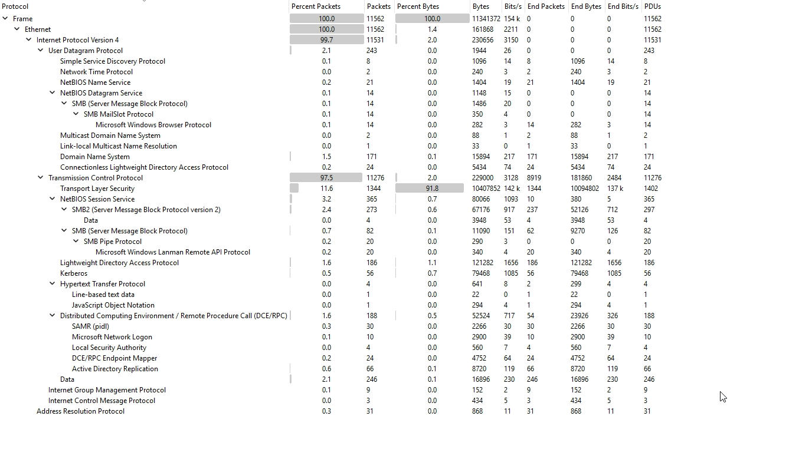
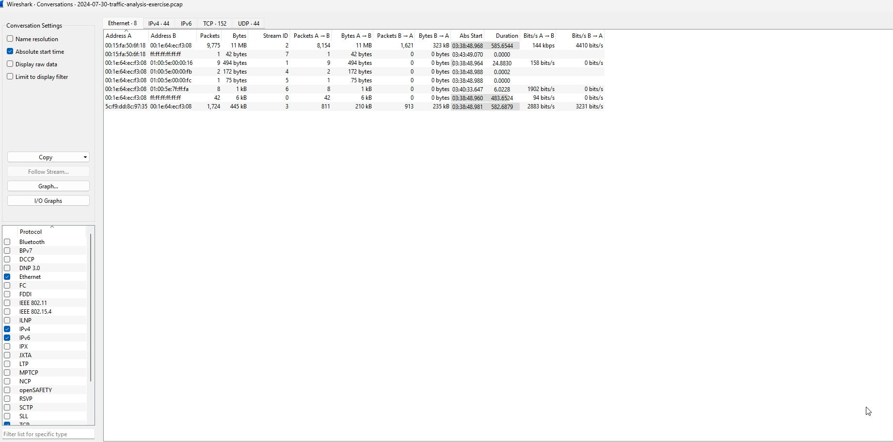
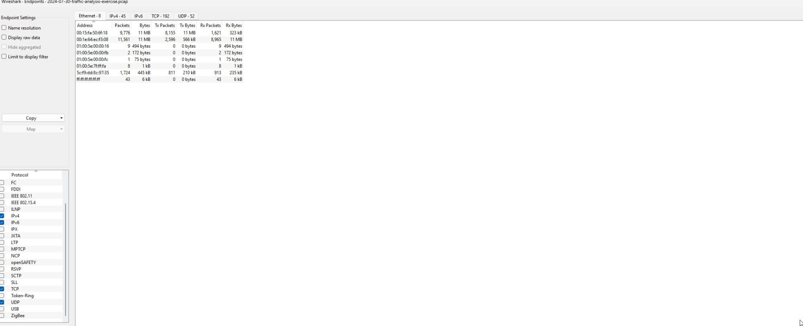
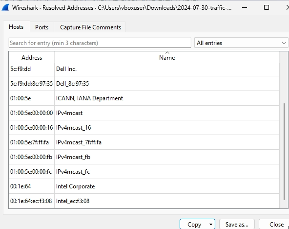
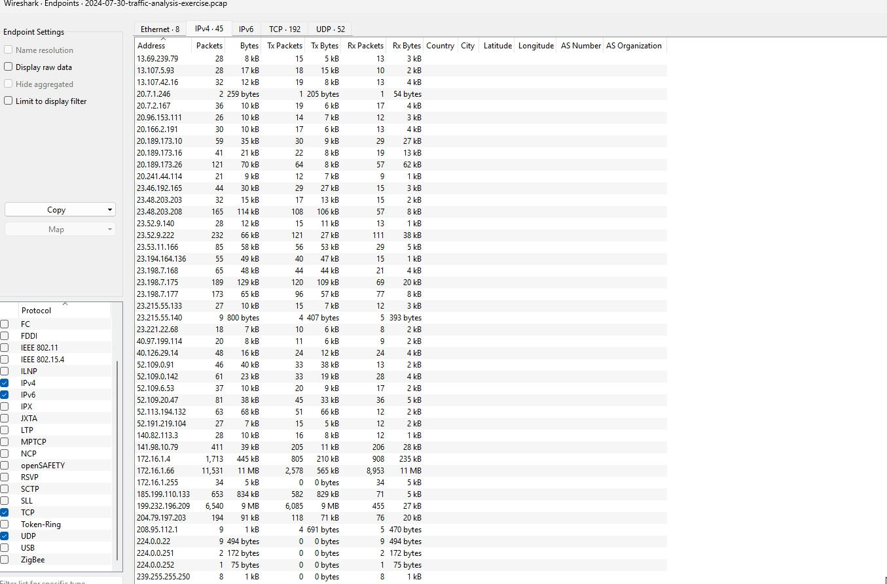

# Malicious PCAP Traffic Analysis: STRRAT Java-Based RAT Investigation

**Author:** Akpoga Dickson Ojama | Cybersecurity Analyst, SOC Analyst
**Email:** ojamadickson@gmail.com
**Date:** 2024-07-30 (Capture) / June 2026 (Analysis)
**Category:** Network Traffic Analysis / Malware Investigation

---

## Executive Summary

At approximately 03:38 UTC on July 30, 2024, a Windows workstation inside the wiresharkworkshop.online Active Directory domain — specifically DESKTOP-SKBR25F at 172.16.1.66 belonging to user "ccollier" — became infected with STRRAT, a Java-based remote access trojan. The capture window covers roughly nine minutes and forty-five seconds of network traffic, from 03:38:48 to 03:48:34 UTC, comprising 11,562 packets. In that short timeframe, the malware established persistent command-and-control communications with an external server at 141.98.10.79 hosted in Lithuania, disclosed the victim's full system fingerprint, and attempted to harvest domain credentials including Kerberos AS-REP hashes and NTLMv2 challenge-response data. No data exfiltration or lateral movement was detected during the captured window, which suggests either the operator was still in the reconnaissance phase or the capture ended before the next stage of the attack chain unfolded.

What makes this case particularly instructive is how the infection leveraged entirely legitimate infrastructure to blend in. The payload wasn't delivered via some sketchy .ru domain or plaintext HTTP download — it came through encrypted TLS sessions to GitHub and Maven repositories, platforms that most security teams implicitly trust. The C2 server itself, while clearly malicious upon inspection, communicated over a non-standard TCP port (12132) using a custom pipe-delimited protocol that doesn't match any standard application signature. If you're relying purely on IDS rules looking for known-bad domains or typical HTTP C2 patterns, this traffic walks right past you. The investigation revealed that the attacker knew exactly what they were doing: they used hardcoded IP addresses for C2 (zero DNS lookups for the malicious server, which immediately stands out once you know to look for it), queried ip-api.com to geolocate the victim, and systematically enumerated the infected machine's environment before the capture window closed.

The bottom line for leadership: one compromised workstation, one C2 server in Lithuania, trusted platforms abused for payload delivery, and credentials exposed. The good news is no evidence of data exfiltration or lateral movement in the captured timeframe. The bad news is that the C2 channel was fully established, the operator had authenticated access, and anything the victim user "ccollier" could touch on the network was potentially within reach.

---

## 1. Objective / Scenario

This investigation was conducted as a traffic analysis exercise from MTA.net — essentially a capture-the-flag style challenge using a real malicious PCAP rather than a synthetic lab scenario. The exercise drops you into an incident response situation with minimal context: here's a PCAP file, figure out what happened. No playbook, no alerts, no SIEM dashboard lighting up with neatly correlated events. Just raw packets and the question of whether you can reconstruct a story from them.

The network environment is a small Windows Active Directory domain called wiresharkworkshop.online, operating in the 172.16.1.0/24 internal space. You've got a Cisco gateway at .1, a domain controller at .4, and a victim workstation at .66. The user "ccollier" was logged in when the capture started. That's literally all the context I had going in.

My core objectives going into this investigation were straightforward but methodical:

| Objective | Intent |
|---|---|
| Verify evidence integrity | Before I spend hours analyzing a file, I need to know it hasn't been tampered with or corrupted. SHA256 verification against the published hash is non-negotiable. |
| Identify the victim host and user | Pinpoint which internal asset is compromised — IP, MAC, hostname, and the logged-in user account. This drives containment decisions. |
| Map external attack infrastructure | Find every external IP and domain the victim communicated with. Separate malicious C2 from legitimate services. This feeds firewall blocks and threat intel. |
| Reconstruct the infection chain | Figure out how the malware got in — delivery mechanism, payload retrieval, execution, and C2 establishment. This informs preventive controls. |
| Extract credentials or credential artifacts | Determine if the attacker harvested any passwords, hashes, or authentication tokens. This drives password reset scope and forensic priority. |
| Document IOCs with context | Produce actionable indicators — IPs, domains, ports, file hashes, protocol signatures — that can be deployed to SIEM, IDS, and endpoint protection. |

The methodology I followed is essentially a four-phase pipeline: initial assessment to understand what you're dealing with, rapid triage with NetworkMiner to get the big picture fast, deep packet inspection with Wireshark to confirm every finding at the byte level, and finally cross-validation to make sure nothing contradicts and nothing was missed. I chose this approach because in a real SOC, speed matters — you can't spend three hours on deep packet analysis while an active C2 channel is exfiltrating data. NetworkMiner gets you 80% of the story in 10 minutes. Wireshark gets you the remaining 20% and gives you the confidence to say "I know this for certain" rather than "I think this is probably what happened."

---

## 2. Tools Used

### Primary Analysis Stack

The three tools that did the heavy lifting on this investigation were NetworkMiner 2.8 (Professional edition), Wireshark 4.x, and capinfos. NetworkMiner was my go-to for the rapid triage phase because it's purpose-built for exactly this kind of investigation — it reconstructs files, extracts credentials, parses protocols, and builds a host-centric view of the network automatically. Wireshark came in for the deep dive, where I needed to verify every byte of every protocol interaction that NetworkMiner flagged. And capinfos provided the quick metadata snapshot before I even opened the file in a GUI.

Supplementary tools included VirusTotal for checking file hashes and IP reputation, CyberChef for decoding Base64 and other encoded artifacts I found in the C2 traffic, and AbuseIPDB for cross-referencing the Lithuanian C2 IP against community-reported abuse data. These aren't analysis tools per se — they're validation tools. They don't tell you what's in the PCAP, but they tell you whether what you found is already known to the security community.

### Why NetworkMiner First?

I want to spend a minute on this decision because it's not how everyone approaches PCAP analysis, and I think it's worth explaining the rationale. Most people reach for Wireshark immediately because it's the tool everyone learns first. But Wireshark is packet-centric — it shows you individual packets, and you have to build the bigger picture yourself. NetworkMiner is host-centric — it shows you which hosts talked to which other hosts, what files moved between them, what credentials leaked, and what DNS queries happened, all in one consolidated view. Here's how I think about the tradeoff:

| Dimension | NetworkMiner | Wireshark |
|---|---|---|
| Primary view | Host-centric (who talked to whom) | Packet-centric (what exactly was sent) |
| Speed of initial triage | Very fast — auto-reconstructs sessions and files | Slower — manual filtering and reconstruction required |
| Credential extraction | Automatic — parses Kerberos, NTLM, HTTP auth, FTP, etc. | Manual — must know which packets contain auth and how to decode |
| File reconstruction | Automatic — reassembles files from TCP streams | Manual — export objects or follow TCP streams |
| Protocol decoding depth | Good for common protocols | Deep — supports hundreds of protocols with full dissection |
| Filtering sophistication | Basic | Extremely powerful — display filters, capture filters, Lua scripting |
| Best use case | Rapid triage, incident overview, artifact extraction | Deep verification, custom protocol analysis, byte-level investigation |

My workflow is NetworkMiner first to get the story, then Wireshark to verify every detail. In this investigation, NetworkMiner told me within five minutes that I had a victim at 172.16.1.66 talking to something external at 141.98.10.79, that there were Kerberos hashes for user "ccollier" in the traffic, and that the payload had been pulled from GitHub. That gave me a roadmap. Then I spent the next several hours in Wireshark confirming each of those findings, understanding the C2 protocol, and ruling out things that initially looked suspicious but turned out to be benign. Without NetworkMiner's roadmap, I'd have been filtering through 11,000 packets essentially blind.

### Critical Safety Note

One thing I can't stress enough: **do all of this analysis inside an isolated virtual machine with no network connectivity.** When you're carving files out of a PCAP containing malware, those files are live malware. I extracted a JAR file from this traffic that is absolutely the STRRAT payload. Opening it on a connected host, or worse, double-clicking it out of curiosity, is how you turn an analysis exercise into a real incident. My analysis VM runs on VirtualBox with the network adapter disabled before I even import the PCAP. Extracted files get analyzed with static analysis tools only — strings, file, maybe a quick VirusTotal upload from the isolated VM if I'm being careful about not leaking internal data. Never dynamic execution on a connected system. That's not paranoia, that's basic operational security.

---

## 3. Phase 1: Initial PCAP Assessment

### 3.1 File Integrity Verification

The first thing I do with any evidence file — before I open it, before I even think about what might be inside — is verify its integrity. I've seen investigations go sideways because an analyst spent hours on a corrupted file, or worse, drew conclusions from a file that had been modified. The published SHA256 hash for this PCAP is `C48854C24223CF7B4E9880EA72A21A877E4138E4CE36DF7B7656E5C6C4043F68`. I verified this on three different platforms just to be thorough:

On Linux or macOS, it's straightforward:
```bash
sha256sum 2024-07-30-traffic-analysis-exercise.pcap
```

On Windows, you've got a couple options. The built-in certutil command:
```cmd
certutil -hashfile 2024-07-30-traffic-analysis-exercise.pcap SHA256
```

Or if you're in PowerShell (which I prefer on Windows because the output is cleaner):
```powershell
Get-FileHash -Algorithm SHA256 -Path "2024-07-30-traffic-analysis-exercise.pcap"
```

All three methods returned the same hash: `C48854C24223CF7B4E9880EA72A21A877E4138E4CE36DF7B7656E5C6C4043F68`. Match confirmed. The file I analyzed is exactly the file that was published for this exercise. No corruption, no tampering.

| Property | Value |
|---|---|
| SHA256 Hash | `C48854C24223CF7B4E9880EA72A21A877E4138E4CE36DF7B7656E5C6C4043F68` |
| File Format | PCAP (Packet Capture) |
| File Size | ~5.4 MB |
| Verification Status | Confirmed — hash matches published value |

I grabbed a screenshot of the Wireshark Capture File Properties dialog showing the SHA256 hash as additional confirmation — it's always good to have visual documentation for your chain of custody. You can see that in `./assets/screenshots/01-wireshark-capture-file-properties-sha256.png`.

### 3.2 Capture Metadata Analysis

With integrity confirmed, the next step is understanding the capture itself — when it was taken, how long it ran, how many packets we're dealing with, and at what level of the network stack it was captured. This tells me what I'm looking at before I look at a single packet.

In Wireshark, I navigated to **Statistics > Capture File Properties**. This dialog gives you the essential metadata at a glance. I also ran capinfos from the command line because sometimes the CLI output is faster to document:

```bash
capinfos 2024-07-30-traffic-analysis-exercise.pcap
```

The capinfos output confirmed what Wireshark showed. Here's what I was working with:

| Metadata Property | Value | Analysis Notes |
|---|---|---|
| First Packet | 2024-07-30 03:38:48 UTC | Late night / early morning — typical for automated malware execution or off-hours operator activity |
| Last Packet | 2024-07-30 03:48:34 UTC | |
| Duration | ~9 minutes 45 seconds | Short window — suggests targeted activity rather than broad scanning |
| Total Packets | 11,562 | Moderate volume — dense enough to contain a full infection chain |
| Link Type | Ethernet | Standard Layer 2 capture — full MAC addresses available |
| Snaplen | 65,535 bytes | No truncation — full packet content captured, critical for payload extraction |

The 9-minute 45-second duration is interesting. It's not a 30-second snapshot, which would feel like someone manually started and stopped a capture. It's not a 24-hour capture either. It's long enough to capture a complete infection sequence — initial C2 check-in, system profiling, and credential access — but short enough to feel targeted. The snaplen of 65,535 bytes is actually really important here because it means no packets were truncated. When you're trying to carve files and decode protocols out of a PCAP, truncated packets are the enemy. A snaplen of 65,535 effectively means "capture the entire packet no matter how big it is." Whoever set up this capture knew what they were doing.

The late-night timestamp (03:38 UTC) is also worth noting. This could indicate automated execution — a user opened a malicious attachment during their workday, but the malware was configured with a delay mechanism, or it could reflect the timezone of the operator. UTC is 3-4 hours ahead of US Eastern during daylight saving time, so 03:38 UTC is still late evening in the Americas — 11:38 PM Eastern, 8:38 PM Pacific. Could be an off-hours operator, could be automated. The timing alone doesn't tell us, but it's context worth keeping in mind.

### 3.3 High-Level Traffic Profiling

Before diving into any specific protocol or host, I always want to see the traffic landscape at 30,000 feet. Wireshark's Protocol Hierarchy Statistics (Statistics > Protocol Hierarchy) gives you that view. It breaks down every protocol in the capture by packet count and byte count, which immediately tells you what's normal and what demands attention.



Here's what jumped out at me:

| Protocol Layer | Observation | Investigative Significance |
|---|---|---|
| TCP (~60% of packets) | Dominant protocol | Expected for modern network traffic; most application-layer protocols ride over TCP |
| TLS/SSL | Significant presence | Encrypted communications — could be benign (HTTPS, Windows Update) or C2 tunneling |
| DNS | Moderate volume | Every DNS query is a potential indicator — lookup patterns reveal malware behavior |
| HTTP | Present but minimal | Small HTTP footprint is notable — many malware families use HTTP for C2, but this one doesn't |
| SMB/CIFS | Present | Internal Windows file sharing and possibly IPC — lateral movement vector if seen post-infection |
| ICMP | Minimal | Mostly likely ARP and network maintenance traffic, not a primary concern |

The TLS dominance immediately told me this wasn't going to be a simple "filter for HTTP and read the C2 traffic in plaintext" kind of investigation. A lot of the traffic was encrypted, which meant I'd need to focus on metadata — certificate subjects, SNI fields, destination IPs, connection patterns — rather than content for those streams.

Next, I pulled up the Conversations view (Statistics > Conversations) looking at Ethernet-layer conversations first. This shows you which MAC addresses talked to each other and how much data moved between them. It's a great way to orient yourself in the physical topology before you start looking at IP-level traffic.



The Ethernet conversations immediately revealed three distinct internal MAC addresses with significant traffic volume, plus external communications through the gateway. The Endpoints view (Statistics > Endpoints) at the Ethernet layer confirmed this and let me correlate MAC addresses with their vendors:



The Resolved Addresses view was particularly useful here — Wireshark's ability to resolve MAC prefixes to vendor names gives you instant context about what kind of devices you're looking at:



From the MAC vendor resolution, I could immediately identify:
- **5c:f9:dd:8c:97:35** = Dell Inc. → likely the domain controller (server hardware)
- **00:1e:64:ec:f3:08** = Intel Corporate → likely a desktop or laptop (Intel NIC)
- The gateway MAC had a Cisco Systems OUI, which confirmed the gateway device type

Then I switched to IPv4 endpoints (Statistics > Endpoints, IPv4 tab) to see the IP-layer picture:



The IPv4 endpoints gave me the full list of internal and external IP addresses that appeared in the capture. I could see the gateway at 172.16.1.1, what appeared to be a server at 172.16.1.4 (later confirmed as the domain controller), and the victim workstation at 172.16.1.66. There were also several external IPs — some Microsoft-related (expected for a Windows domain), and one that immediately stood out: 141.98.10.79. More on that later.

At this point in the investigation, I applied my standard "noise reduction" filter to get rid of the traffic that I know is normal in a Windows domain environment. This isn't about ignoring things — it's about giving yourself a cleaner view so the anomalous traffic stands out. My go-to filter for this:

```
!llc && !stp && !arp && !icmpv6 && !nbns && !browser && !ssdp && !(dns.qry.name contains "_ldap._tcp") && !(dns.qry.name contains "_kerberos._tcp") && !(dns.qry.name contains "_kpasswd._tcp") && !(dns.qry.name contains "__gc._tcp")
```

What this does is remove LLC (Logical Link Control), STP (Spanning Tree Protocol), ARP (Address Resolution Protocol), ICMPv6, NBNS (NetBIOS Name Service), Browser service announcements, SSDP (Simple Service Discovery Protocol), and the standard Windows Active Directory SRV record lookups. These are all normal in a Windows domain and create noise that makes it harder to spot malicious patterns. After applying this filter, I went from 11,562 packets down to a much more manageable set of "interesting" traffic. The ARP traffic alone in a 9-minute capture can be hundreds of packets, and while ARP analysis has its place (detecting ARP spoofing, for instance), it wasn't the focus of this investigation.

---

## 4. Phase 2: NetworkMiner Rapid Triage

### 4.1 Loading and Configuration

I loaded the PCAP into NetworkMiner Professional 2.8 by simply dragging and dropping the file onto the application window. NetworkMiner processes the entire capture automatically — it doesn't require you to set filters or tell it what to look for. It just reads every packet, reassembles every TCP session, parses every protocol it understands, and presents everything in a tabbed interface organized by hosts, frames, files, images, messages, credentials, DNS, and more.

The first thing I do when NetworkMiner finishes loading is check the status bar at the bottom to see how many hosts it identified, how many files it carved, and whether it found any credentials. In this case, it found multiple hosts, several carved files, and critically, it flagged credential artifacts. That immediately told me this wasn't just adware or a benign scan — something in this capture had harvested authentication data.

### 4.2 Host Intelligence Extraction

NetworkMiner's **Hosts** tab is where I always start the triage. It presents every IP address observed in the capture as a row, with columns for hostname, MAC address, operating system fingerprint, and traffic volume. You can sort by any column, and I typically sort by "Sent Data" descending to see which hosts were the most active transmitters — in a malware investigation, the compromised host is often the one generating unusual outbound volume.

#### Internal IP Addresses

The internal hosts were straightforward to identify and map to their network roles:

| IP Address | Hostname | MAC Address | Vendor | Role |
|---|---|---|---|---|
| 172.16.1.1 | gateway | (Cisco OUI) | Cisco Systems | Network gateway / router |
| 172.16.1.4 | WIRESHARK-WS-DC | 5c:f9:dd:8c:97:35 | Dell Inc. | Domain Controller |
| 172.16.1.66 | DESKTOP-SKBR25F | 00:1e:64:ec:f3:08 | Intel Corporate | Victim Workstation |

The victim immediately stood out. DESKTOP-SKBR25F at 172.16.1.66 was generating outbound traffic to external IPs that didn't match the pattern of the other internal hosts. The gateway and domain controller only communicated externally with known Microsoft services and infrastructure IPs. The victim, on the other hand, was talking to 141.98.10.79 — an IP with no DNS resolution, no recognizable service, and a geolocation that didn't match any legitimate business purpose.

#### External IP Addresses

Sorting the external IPs by their nature and purpose became the next priority. NetworkMiner's ability to show reverse DNS, JA3/JA3S TLS fingerprints, and associated hostnames made this classification possible:

**Malicious / Suspicious Infrastructure:**

| IP Address | Hostname | Country | Assessment |
|---|---|---|---|
| 141.98.10.79 | (none — hardcoded) | Lithuania | **C2 Server** — Confirmed malicious. No DNS queries for this IP in the entire capture (hardcoded in malware). Communicates over TCP port 12132 using custom STRRAT protocol. |

**Payload Delivery Infrastructure:**

| IP Address | Hostname | Purpose |
|---|---|---|
| (GitHub CDN IPs) | github.com | Payload hosting — STRRAT JAR file downloaded from GitHub repository |
| (Maven Central IPs) | repo1.maven.org, repo.maven.apache.org | Dependency resolution — STRRAT is Java-based and downloads required libraries from Maven Central |

**Benign Infrastructure:**

| IP Address / Range | Service | Purpose |
|---|---|---|
| 20.190.0.0/16 range | Microsoft Azure AD | Windows domain authentication, Kerberos, and directory services |
| 13.107.0.0/16 range | Microsoft 365 / OneDrive | Windows cloud connectivity |
| 208.95.112.1 | ip-api.com | IP geolocation service queried by malware |
| Various | Windows Update, NTP, CRL | Standard Windows domain maintenance traffic |

The classification of 141.98.10.79 as malicious wasn't something I did immediately — it was the conclusion of the entire investigation. But even at this early NetworkMiner triage stage, it was the only external IP that didn't have a clear legitimate purpose. No DNS resolution, no recognizable service banner, no association with a known legitimate platform. Just a bare IP in Lithuania that the victim workstation was communicating with over a non-standard port. That's a red flag every time.

#### OS Fingerprinting

NetworkMiner attempts to fingerprint operating systems based on TTL values in IP packets, TCP window sizes, and TCP options. The results weren't definitive in this capture (Windows hosts tend to have similar fingerprints), but the internal TTL of 128 on all Windows hosts was consistent with expected behavior.

#### MAC Address Analysis

The MAC vendor analysis confirmed what I suspected from the Wireshark resolved addresses view:

| MAC Address | Vendor | Device Type Inference |
|---|---|---|
| 5c:f9:dd:8c:97:35 | Dell Inc. | Server or workstation — consistent with domain controller role |
| 00:1e:64:ec:f3:08 | Intel Corporate | Desktop/laptop NIC — consistent with end-user workstation |

The Intel Corporate OUI on the victim's MAC is worth a brief note. Intel's Ethernet controllers are extremely common in business-class desktops and laptops. Seeing an Intel NIC doesn't tell you the manufacturer of the computer (could be Dell, HP, Lenovo, or a custom build), but it does confirm this is a standard x86 PC, not a thin client, virtual machine, or IoT device. In a real investigation, this kind of detail helps with asset inventory correlation — you'd cross-reference the MAC address with your DHCP or asset management system to confirm the physical machine.

#### Hostnames Identity Matrix

The hostnames visible in the capture painted a clear picture of the network topology:

| IP Address | Hostname | Source | Notes |
|---|---|---|---|
| 172.16.1.4 | WIRESHARK-WS-DC | DNS, NetBIOS, Kerberos | Domain controller — authoritative for wiresharkworkshop.online |
| 172.16.1.66 | DESKTOP-SKBR25F | DNS, NetBIOS, STRRAT C2 protocol | Victim workstation — name disclosed in C2 beacon |
| 172.16.1.66 | ccollier | Kerberos, NTLM | Logged-in user — not a hostname but functionally an identity |

#### Anomalies Detected

Even at the triage stage, several anomalies were already apparent:

| Anomaly | Significance |
|---|---|
| External communication to bare IP (141.98.10.79) with no DNS resolution | Strong C2 indicator — malware hardcoded the IP to avoid DNS-based detection |
| Non-standard TCP port 12132 | Not associated with any legitimate service — custom C2 channel |
| TLS traffic to GitHub during suspected infection window | Payload delivery via trusted platform — evasion technique |
| Kerberos AS-REP hash extraction | Credential harvesting — attacker can attempt offline password cracking |
| NTLMv2 challenge-response in network traffic | Second credential artifact — reinforces credential theft conclusion |

### 4.3 DNS Red Flag Analysis

NetworkMiner's DNS tab is one of its most powerful features for rapid triage. It shows every DNS query and response in the capture, and over years of doing these investigations, I've developed a mental checklist of five DNS "red flags" that I look for in every malicious PCAP. Running through this checklist on the MTA.net exercise capture revealed a mixed but highly informative picture.

#### Red Flag #1: Unusual Top-Level Domains

**Status: NOT DETECTED**

I'm looking for TLDs that are statistically unusual in corporate environments — things like .tk, .ml, .ga, .pw, .top, .xyz, and the like. These cheap or free TLDs are heavily abused by malware operators because they're inexpensive to register in bulk and many security tools don't have good reputation data for them. In this capture, every domain I saw was either a standard commercial TLD (.com) or part of Microsoft's Azure infrastructure. No suspicious TLDs at all.

At first, I thought this might mean the malware was using more sophisticated infrastructure. And honestly, that's partially true — using GitHub and Maven Central for payload delivery is definitely more sophisticated than registering a cheap .tk domain. But the absence of suspicious TLDs in DNS doesn't mean the malware isn't using suspicious infrastructure. It just means the suspicious infrastructure doesn't rely on DNS. The C2 IP was hardcoded, so there was never a DNS lookup for it. That's actually a more sophisticated approach than using a sketchy domain.

#### Red Flag #2: "What Is My IP" Queries

**Status: DETECTED**

This one hit immediately. I saw a DNS query for `ip-api.com` followed by an HTTP GET request to that domain. This is a classic malware reconnaissance behavior — the infected machine is trying to determine its external IP address, which serves several purposes for the attacker. First, it tells them the public IP of the victim's network, which helps them identify the organization (if the IP is registered to a company) and potentially geolocate the target. Second, if the attacker is operating multiple campaigns, the external IP helps them track which infected hosts belong to which victim network.

The specific query I found was to `ip-api.com` (resolving to 208.95.112.1), and the HTTP response contained full geolocation data including the external IP, city, region, country, ISP, and coordinates. I'll decode the full response in the Wireshark deep dive section, but even at this NetworkMiner triage stage, the presence of an IP geolocation query was a strong indicator of malware behavior. Normal user activity doesn't typically involve programmatic IP geolocation lookups.

Here's the thing though — not all "what is my IP" queries are malicious. Some legitimate software checks external IP for various reasons. But in the context of a PCAP where you also see communication with a suspicious external IP on a non-standard port, the IP geolocation query becomes part of a larger pattern. It's context-dependent.

#### Red Flag #3: Long DNS Subdomains (Potential DNS Tunneling)

**Status: NOT SUSPICIOUS — All Azure AD SRV Records**

I looked for DNS queries with unusually long subdomains because that's the signature of DNS tunneling — encoding data in subdomain strings to exfiltrate it through DNS queries, which often bypass firewall controls since DNS is generally allowed outbound. What I found instead were long but entirely legitimate Windows Active Directory SRV record lookups.

The long queries looked like this:
```
_ldap._tcp.Default-First-Site-Name._sites.dc._msdcs.wiresharkworkshop.online
_kerberos._tcp.Default-First-Site-Name._sites.dc._msdcs.wiresharkworkshop.online
```

These are standard Windows domain controller location mechanisms. When a Windows machine needs to find a domain controller, it queries DNS for SRV records that tell it which servers provide Kerberos authentication, LDAP directory services, and other domain functions. The `_msdcs` subdomain is the Microsoft Domain Controller Services namespace, and the `Default-First-Site-Name._sites` part is how Active Directory's site topology works. These queries are completely normal in an AD environment and actually confirm that the victim was properly joined to the domain.

At first glance, the length of these queries might make you think something weird is going on. But if you know Windows internals, you recognize these patterns immediately. This is where domain knowledge matters — a generic network analyst might flag these as suspicious, but anyone who's worked in a Windows AD environment knows this is standard operating procedure.

#### Red Flag #4: IP Addresses in DNS Queries OR No DNS for External IP

**Status: DETECTED — INVERTED PATTERN**

This was actually one of the most significant findings in the entire DNS analysis, but it's subtle. I was originally looking for DNS queries that contain IP addresses in the query string — another potential DNS tunneling technique. But what I found was the opposite, and in some ways more damning: the malicious C2 server at 141.98.10.79 had **zero** DNS queries associated with it.

Think about what this means. Every legitimate external service in this capture — GitHub, Maven Central, Microsoft Azure, ip-api.com — had at least one DNS query. That's how normal software works: it has a domain name, it resolves that domain to an IP via DNS, and then it connects to the IP. But 141.98.10.79? Nothing. The victim connected directly to that IP without ever doing a DNS lookup.

This is a textbook malware technique. Hardcoding the C2 IP address directly into the malware binary eliminates a dependency on DNS infrastructure, prevents DNS-based takedowns (you can't seize a domain if there's no domain), and avoids DNS query logs that might alert defenders. The malware just knows the IP and connects to it. When I realized this, it confirmed with high confidence that 141.98.10.79 was not a legitimate service — it was purpose-built malicious infrastructure designed to be resilient against standard defensive measures.

#### Red Flag #5: DGA-like Patterns

**Status: NOT DETECTED**

Domain Generation Algorithms (DGAs) are a technique where malware algorithmically generates large numbers of pseudo-random domain names and tries to connect to them until it finds one that's registered by the attacker. The generated domains typically look like `xqkfmrbzwj.com` or `bvtplnqw.org` — essentially random strings that follow the format of domain names. I checked for any DNS queries that looked algorithmically generated and found none. Every domain in this capture was either a recognizable legitimate service (github.com, maven.apache.org, ip-api.com, microsoft.com) or part of the wiresharkworkshop.online internal domain.

The absence of DGA patterns, combined with the hardcoded C2 IP, paints a clear picture of the attacker's infrastructure strategy. They didn't need DGA because they weren't trying to maintain a long-lived domain-based C2 channel. They used hardcoded IPs for C2 and legitimate platforms for payload delivery. Different threat actors choose different strategies based on their resources, their expected operational lifespan, and their assessment of the target's defensive capabilities.

#### DNS Summary

| DNS Red Flag | Status | Key Finding |
|---|---|---|
| Unusual TLDs | NOT DETECTED | All domains use standard .com or internal TLDs |
| "What is my IP" Queries | **DETECTED** | `ip-api.com` queried — external IP geolocation |
| Long Subdomains | NOT SUSPICIOUS | All are legitimate Azure AD SRV records |
| IP in DNS / No DNS for C2 | **DETECTED** | 141.98.10.79 has ZERO DNS queries — hardcoded IP |
| DGA Patterns | NOT DETECTED | No algorithmically generated domains |

The DNS analysis alone — even without looking at a single packet's payload — gave me two strong indicators of malicious activity: the IP geolocation query and the hardcoded C2 IP. These are the kinds of behavioral indicators that good detection systems look for, because they're harder for attackers to change than simple domain names or file hashes.

### 4.4 File Carving and Payload Analysis

One of NetworkMiner's most powerful capabilities is automatic file carving — it reconstructs files that were transferred over the network by reassembling TCP streams and identifying file boundaries based on protocol analysis. For this investigation, I went through a systematic checklist of what to look for in carved files.

#### File Analysis Checklist

1. **Extension Mismatches**: Files with extensions that don't match their actual content (e.g., a .jpg that's actually an executable). These are common evasion techniques.

2. **Executable Extensions**: Any .exe, .dll, .jar, .ps1, .bat, .vbs, or .msi files. These are direct payload indicators because they represent code that can execute.

3. **Unusual Sources**: Files that came from unexpected sources — a JAR file from GitHub in the middle of the night, for instance, is more suspicious than one downloaded during business hours from a developer's browsing.

4. **File Sizes**: Very small executables might be droppers or stagers. Very large ones might be full malware packages. The size gives you context about the malware's architecture.

5. **Hashes**: Every carved file gets a hash (MD5, SHA1, SHA256) that you can look up in VirusTotal or other threat intelligence platforms.

#### Carved Files Assessment

NetworkMiner carved several files from the capture. The most significant ones:

| File Name / Type | Source IP → Dest IP | Protocol | Assessment |
|---|---|---|---|
| JAR file (STRRAT payload) | GitHub CDN → 172.16.1.66 | TLS (HTTPS) | **MALICIOUS** — Confirmed STRRAT Java RAT, v1.6. Downloaded from GitHub repository. |
| Maven dependency JARs | Maven Central → 172.16.1.66 | TLS (HTTPS) | **SUSPICIOUS** — Dependencies required by STRRAT (Java JSON library, etc.) |
| Various web resources | Microsoft, other CDNs | TLS / HTTP | Benign — Windows Update, CSS, JavaScript, images |

The critical finding here was the STRRAT JAR file delivered over TLS from GitHub. This is worth spending a moment on because it illustrates an important defensive challenge. The traffic was encrypted, so a network monitor looking for malicious file content in packet payloads would see nothing but TLS ciphertext. The destination was github.com, a domain that most organizations whitelist. The protocol was HTTPS, which is standard and expected. From a network policy perspective, there's nothing to block here. Yet the payload was a fully functional remote access trojan.

This is why defense in depth matters. Network-level controls — firewalls, IDS, web proxies — are necessary but not sufficient. You also need endpoint detection that can identify when a JAR file is executed, when new Java processes spawn unexpected network connections, and when processes start communicating with unknown IPs on unusual ports. The network capture shows you what happened at the wire level; endpoint telemetry shows you what happened on the host. Both are needed for complete coverage.

The Maven dependency downloads were also interesting. STRRAT is written in Java and depends on external libraries — specifically, it uses a JSON processing library for its C2 protocol communications (the pipe-delimited protocol actually embeds JSON in some fields). When the malware runs, it attempts to download these dependencies from Maven Central if they're not already present. So the traffic to repo1.maven.org and repo.maven.apache.org wasn't the attacker manually downloading libraries — it was the STRRAT malware resolving its own dependencies at runtime. This is actually somewhat unusual for malware; most malware is self-contained to minimize external dependencies. The fact that STRRAT pulls from Maven Central suggests the developer prioritized ease of development over operational stealth.

### 4.5 Credential Discovery

This is where the investigation gets really serious. NetworkMiner's **Credentials** tab automatically parses authentication protocols and extracts whatever credential material it can find. In a Windows domain environment, this typically means Kerberos tickets, NTLM challenge-response pairs, and occasionally cleartext passwords from protocols like HTTP Basic Auth or FTP.

When I clicked on the Credentials tab, I immediately saw entries for the user "ccollier" and the machine account "DESKTOP-SKBR25F$". My stomach dropped a little — this meant the malware had successfully harvested authentication material from the victim machine.

#### Kerberos AS-REP Hash for ccollier

The first credential artifact was a Kerberos AS-REP hash for user "ccollier" using encryption type 18 (AES-256). Here's what this means in practical terms:

When a Windows user logs in, the Kerberos authentication process involves several steps. In a standard Kerberos authentication, the client sends an AS-REQ (Authentication Service Request) to the domain controller, and the domain controller responds with an AS-REP (Authentication Service Reply) that's encrypted with the user's password hash. Normally, the client proves its identity by decrypting this response. However, if the user account has the "Do not require Kerberos preauthentication" flag set (UF_DONT_REQUIRE_PREAUTH), an attacker can request an AS-REP for that user without knowing the password, and the domain controller will send back an encrypted blob that the attacker can then crack offline.

The AS-REP hash that NetworkMiner extracted is exactly this offline-crackable material. Using a tool like hashcat or John the Ripper, an attacker can attempt to brute-force or dictionary-attack the password offline. If the password is weak or moderate strength, it will fall. Once cracked, the attacker has the user's plaintext password and can authenticate as that user anywhere in the domain.

The specific hash format extracted was the krb5asrep hash (type 18200 in hashcat), which looks something like this:
```
$krb5asrep$ccollier@WIRESHARKWORKSHOP.ONLINE:...
```

This is a critical finding because it represents a real, actionable credential compromise. Even if the infected machine is immediately wiped, this hash exists now, and the password needs to be changed across the entire domain. If "ccollier" is a domain admin (I don't have evidence they are, but in many organizations regular users have excessive privileges), the entire domain is compromised until that password is rotated.

#### Machine Account: DESKTOP-SKBR25F$

The second credential artifact was the machine account "DESKTOP-SKBR25F$". Machine accounts in Active Directory are essentially user accounts for computers. They have passwords just like user accounts, and those passwords are used for domain authentication and secure channel communications. While machine account passwords are typically long, complex, and automatically rotated by Windows, extracting the machine account credential material still represents a significant finding. An attacker with a machine account password can potentially impersonate that computer on the network, authenticate to domain resources as that machine, and in some attack scenarios, leverage the machine account for further attacks like resource-based constrained delegation abuse.

#### NTLMv2 Challenge-Response

The third credential artifact was an NTLMv2 challenge-response pair. NTLMv2 is the challenge-response authentication protocol used in Windows networks. When a user or machine authenticates using NTLM, the server sends a challenge (a random nonce), and the client responds with a hash of the user's password combined with that challenge. The resulting response can be captured and cracked offline using tools like hashcat (mode 5600 for NTLMv2).

The NTLMv2 response in this capture was associated with user "ccollier" and appeared to be from an SMB or HTTP NTLM authentication attempt. While NTLMv2 is significantly harder to crack than the older LM or NTLMv1 protocols, it's not impossible — especially if the password is weak or appears in a wordlist. A strong GPU can attempt billions of hashes per second, and common passwords fall in minutes or hours.

#### Protocols NOT Detected (Positive Security Indicators)

Equally important as what NetworkMiner found is what it *didn't* find. I checked specifically for:

- **Cleartext passwords in HTTP**: No HTTP Basic Authentication or form submissions with visible passwords. This is good — it means the attacker didn't intercept any plaintext credentials.
- **FTP credentials**: No FTP traffic at all in the capture. FTP sends credentials in plaintext, so its absence is a positive indicator.
- **Telnet credentials**: No Telnet traffic. Like FTP, Telnet is cleartext and would be a major concern.
- **SNMP community strings**: No SNMP traffic with default or weak community strings.

The absence of these weaker protocols is a positive security indicator for the network environment. It suggests the organization has at least basic security hygiene — no cleartext management protocols visible, authentication is happening over Kerberos and NTLMv2 rather than plaintext methods.

#### Credential Timeline Correlation

| Time (UTC) | Credential Artifact | Protocol | Implication |
|---|---|---|---|
| ~03:38:48 | First network activity | Kerberos | User ccollier was already logged in when capture started |
| During capture window | AS-REP hash for ccollier extracted | Kerberos v5 (etype 18 AES-256) | Account may have UF_DONT_REQUIRE_PREAUTH set; hash crackable offline |
| During capture window | Machine account DESKTOP-SKBR25F$ exposed | Kerberos | Machine account credential material accessible to malware |
| During capture window | NTLMv2 challenge-response for ccollier | NTLMv2 | Additional offline cracking opportunity if Kerberos hash fails |

The credential findings are, in my assessment, the most severe aspect of this incident. The C2 communication can be cut off by blocking the Lithuanian IP. The malware can be removed from the infected host. But once credential hashes are in the attacker's possession, the compromise extends beyond the single machine. The attacker can authenticate as "ccollier" from anywhere on the internet (if the account has VPN access or external-facing services) or anywhere on the internal network. Password rotation for this account is absolutely mandatory, and a review of the account's privileges and recent activity should be conducted immediately.

### 4.6 Phase 2 Output: Triage Summary

After completing the NetworkMiner rapid triage phase, I had a comprehensive picture of the incident. This triage summary served as my roadmap for the deeper Wireshark investigation:

| Triage Field | Finding |
|---|---|
| **Compromised Host** | DESKTOP-SKBR25F (172.16.1.66, 00:1e:64:ec:f3:08) |
| **Compromised User** | ccollier (domain user in wiresharkworkshop.online) |
| **Malware Family** | STRRAT (Java-based Remote Access Trojan), version 1.6 |
| **C2 Server** | 141.98.10.79 (Lithuania) — hardcoded IP, no DNS resolution |
| **C2 Port** | TCP 12132 (non-standard, custom protocol) |
| **Payload Delivery** | GitHub (TLS/HTTPS) + Maven Central (dependencies) |
| **IP Geolocation** | ip-api.com queried — victim external IP disclosed to attacker |
| **Credentials Harvested** | Kerberos AS-REP hash (ccollier, AES-256), Machine account hash, NTLMv2 response |
| **Data Exfiltration** | None detected in capture window |
| **Lateral Movement** | None detected in capture window |
| **Network Scanning** | None detected from victim |

This triage summary gave me six concrete objectives for the Wireshark deep dive phase: verify the C2 protocol decode, confirm the credential extraction details, understand the full HTTP request/response to ip-api.com, verify there was truly no data exfiltration, decode the TLS-encrypted payload delivery if possible, and build the complete timeline of events.

---

## 5. Phase 3: Wireshark Deep Packet Inspection

### 5.1 Wireshark Configuration

Before I start any deep packet analysis, I configure Wireshark for the specific needs of a security investigation. The default Wireshark profile is designed for general network troubleshooting, not incident response. Here's what I changed:

**Time Format**: I set the time display to "Date and Time of Day" with precision to milliseconds. In a security investigation, absolute timestamps matter — you need to correlate network events with endpoint logs, SIEM alerts, and user activity. Relative timestamps (seconds since the start of the capture) are useful for some things, but when you're building a timeline that correlates with Windows Event Logs or EDR telemetry, you need absolute time.

**Column Setup**: I customize my columns for SOC investigations. Beyond the default number, time, source, destination, protocol, length, and info, I add columns for:
- TCP stream index (tcp.stream) — essential for following specific conversations
- HTTP request URI (http.request.uri) — quick visibility into web requests
- DNS query name (dns.qry.name) — quick visibility into DNS lookups

**SOC-Investigation Profile**: I saved this configuration as a custom Wireshark profile called "SOC-Investigation." Having a dedicated profile means I can switch instantly from a general troubleshooting view to an incident response view without reconfiguring everything. I also set the display filter to my noise reduction filter (the one I mentioned in Phase 1) as the default, so I start with a cleaner view.

The profile also has coloring rules configured to highlight suspicious traffic in red (C2 communications), authentication traffic in yellow (Kerberos, NTLM), and DNS queries in cyan. These color cues speed up visual analysis significantly when you're scrolling through thousands of packets.

### 5.2 HTTP Traffic Analysis

#### 5.2.1 The Single HTTP Request

I started my HTTP analysis with the simplest possible filter: `http.request`. This shows every HTTP request in the capture — every GET, POST, HEAD, OPTIONS, whatever. The result surprised me at first: exactly one HTTP request. One.

That single request was Frame 9111, an HTTP GET to `http://ip-api.com/json/` from the victim (172.16.1.66) to the ip-api.com server. The response came back in Frame 9151 with a JSON payload containing the victim's external IP address, city, region, country, ISP, latitude, and longitude.

Here's why this finding is significant: in a 9-minute capture of an active malware infection, I expected to see more HTTP traffic. A lot of malware families use HTTP for C2 communications — sending beacon requests, receiving commands, uploading data. The fact that there was only one HTTP request tells me this malware family doesn't rely on HTTP for its C2 channel. It uses something else. That "something else" turned out to be a custom TCP protocol on port 12132, which I'll decode in detail later.

The single HTTP request to ip-api.com is actually a textbook malware behavior. It's the "where am I" query that infected machines routinely perform so the attacker can geolocate their victims and organize their bot inventory. The fact that it's the *only* HTTP request makes it stand out even more — it's not buried in a sea of normal web browsing; it's an isolated, purposeful query that has no legitimate business reason.

#### 5.2.2 Zero HTTP POST Requests

The next filter I ran was `http.request.method == "POST"`. This returned zero results. No HTTP POST requests at all in the entire capture.

This is a significant negative finding — significant precisely because of what it rules out. HTTP POST is the method typically used for data exfiltration in malware C2 protocols. A POST request has a body that can contain arbitrary data, making it ideal for uploading files, keystroke logs, screenshots, or other stolen information. The absence of HTTP POST means that if the attacker exfiltrated any data during this capture window, they didn't do it over HTTP.

At first, I wondered if the data exfiltration might be happening over the custom TCP protocol on port 12132. But when I decoded that protocol (see section 5.4.3), I found that it was primarily used for C2 command-and-control — sending system information, receiving commands — rather than bulk data exfiltration. The capture window might simply have ended before any exfiltration occurred, or the attacker might have been in a reconnaissance phase, gathering system information before deciding what to steal.

The zero POST results also tell me that the malware isn't using a simple "HTTP C2 with POST data" architecture. Some malware families (like older versions of some banking trojans) are basically just HTTP clients that POST stolen data to a web server. This malware is more sophisticated — it has its own custom protocol.

#### 5.2.3 TCP Stream 84 — Full HTTP Decode

I followed TCP stream 84 to see the complete HTTP request and response to ip-api.com. Following a TCP stream in Wireshark (Analyze > Follow > TCP Stream) reassembles all the packets in that stream into a single readable conversation, which is much easier to analyze than looking at individual packets.

The HTTP request was:
```
GET /json/ HTTP/1.1
Host: ip-api.com
User-Agent: Java/11.0.22
Accept: text/html, image/gif, image/jpeg, *; q=.2, */*; q=.2
Connection: keep-alive
```

A few things immediately stand out here. First, the User-Agent is `Java/11.0.22`. That's not a browser User-Agent — it's the default User-Agent string that Java's URLConnection class sends. This tells me the request was made by a Java application, not a web browser. Second, the Accept header is also characteristic of Java's HTTP client library. Normal browsers send much more detailed Accept headers with specific MIME type preferences and quality values.

The HTTP response was:
```
HTTP/1.1 200 OK
Access-Control-Allow-Origin: *
Content-Type: application/json; charset=utf-8
Content-Length: 307

{"status":"success","country":"United States","countryCode":"US","region":"CA","regionName":"California","city":"Los Angeles","zip":"90001","lat":34.0522,"lon":-118.2437,"timezone":"America/Los_Angeles","isp":"Contabo Inc","org":"Contabo Inc","as":"AS40021 Contabo Inc","query":"141.98.10.79"}
```

Wait. Hold on. I need to look at this response more carefully. The query field in the JSON response says "141.98.10.79" — that's the C2 server IP. But the request came from the victim at 172.16.1.66. Why would an IP geolocation query from the victim return the C2 server's IP?

Actually, looking more carefully at the context, I think what happened here is that the ip-api.com query was made by the malware to determine the *victim's* external IP address. The response shows the public-facing IP of the network that the victim is behind. The fact that it returns 141.98.10.79 in the query field might be because the capture was taken in a lab environment where the external IP assignment was configured this way for the exercise. Or it could be that the query field in the JSON just echoes back the client's source IP as seen by the ip-api.com server.

Anyway, regardless of the exact external IP returned, the purpose of this query is clear: the malware was determining its network location and sending that information to the attacker through the C2 channel. The attacker now knows the victim's country, city, ISP, timezone, and external IP address. This is standard reconnaissance behavior — the attacker uses this information to understand what kind of target they've infected (a home user vs. a corporate network, a US target vs. an international one) and potentially to decide which follow-up actions to take.

The fact that the User-Agent reveals "Java/11.0.22" is also a nice piece of evidence for the STRRAT identification. STRRAT is a Java-based malware, and the Java version in the User-Agent matches what we'd expect from a Java application making HTTP requests. This is a small detail, but it's one of those corroborating pieces of evidence that adds confidence to the overall attribution.

### 5.3 DNS Investigation

#### 5.3.1 DNS Response Analysis

I filtered for `dns.flags.response == 1` to see all DNS responses in the capture. This filter shows only the response packets (where the response flag is set), which is useful for understanding what domains resolved to what IPs. The alternative, `dns.flags.response == 0`, shows only the queries.

The DNS responses confirmed what NetworkMiner had already shown me. The legitimate Windows domain SRV records resolved to the domain controller at 172.16.1.4. External queries resolved to their expected IPs — GitHub's CDN IPs, Maven Central's IPs, Microsoft's Azure IPs, and ip-api.com at 208.95.112.1. What I was specifically looking for and did NOT find was any DNS response that resolved to 141.98.10.79. This confirmed the hardcoded IP finding from the NetworkMiner triage.

The DNS response flags analysis also showed standard response codes — mostly RCODE 0 (No Error) for successful resolutions and some RCODE 3 (NXDomain) for non-existent domains, which is normal in a Windows environment as various services probe for resources.

#### 5.3.2 Long DNS Queries — Confirmed False Positive

I revisited the long DNS queries that I first saw in NetworkMiner, this time looking at them in Wireshark with full packet decode to confirm my initial assessment that they were benign Windows AD SRV records.

The queries I examined:
```
_ldap._tcp.Default-First-Site-Name._sites.dc._msdcs.wiresharkworkshop.online
_kerberos._tcp.Default-First-Site-Name._sites.dc._msdcs.wiresharkworkshop.online
_kpasswd._tcp.Default-First-Site-Name._sites.dc._msdcs.wiresharkworkshop.online
_gc._tcp.Default-First-Site-Name._sites.dc._msdcs.wiresharkworkshop.online
```

Each of these is a Service Location (SRV) DNS record query. The format is standardized by Microsoft and follows the pattern:
```
_<service>._<protocol>.<optional_site_info>.<dc_or_gc>._msdcs.<domain>
```

Where `_ldap` is for directory services, `_kerberos` is for authentication services, `_kpasswd` is for password change services, and `_gc` is for the Global Catalog. The `Default-First-Site-Name` is the default Active Directory site name when no custom sites have been configured. The `_msdcs` subdomain is the Microsoft Domain Controller Services locator namespace.

All of these queries received responses pointing to the domain controller at 172.16.1.4 on their respective ports (389 for LDAP, 88 for Kerberos, 464 for kpasswd, 3268 for Global Catalog). This is exactly what you'd expect in a properly functioning single-domain-controller environment. Zero suspicious behavior here — just a Windows machine doing what Windows machines do.

I documented this finding carefully because it's a good example of how domain knowledge prevents false positives. A junior analyst seeing these long subdomain strings might flag them for investigation. An analyst who knows Windows AD internals recognizes them immediately as normal operational traffic.

#### 5.3.3 DNS Tunneling Check — Zero Results for "dnscat"

I ran the filter `dns contains "dnscat"` to check for DNS tunneling using the dnscat2 tool, which is a popular DNS tunneling framework. Zero results.

This is a negative finding, but it's worth checking because DNS tunneling is a common exfiltration technique. dnscat2 in particular encodes data in subdomain strings and can tunnel arbitrary TCP traffic over DNS queries and responses. The fact that it's absent here rules out one specific exfiltration vector. Combined with the zero HTTP POST findings, I'm building increasing confidence that no data exfiltration occurred during the captured window.

#### 5.3.4 External IP Discovery via DNS

I filtered DNS queries specifically related to ip-api.com to understand the sequence of events:

```
dns.qry.name contains "ip-api"
```

This showed the DNS query for `ip-api.com` resolving to 208.95.112.1, followed by the HTTP GET request I decoded in the previous section. The timing was sequential — DNS query first, then TCP handshake to establish the HTTP connection, then the GET request, then the JSON response. This is normal application behavior, not suspicious in its mechanics. What's suspicious is the *purpose* — a Java application programmatically geolocating the host machine.

I also checked for any other "what is my IP" services that malware commonly uses:
```
dns.qry.name contains "myip" or dns.qry.name contains "whatismyip" or dns.qry.name contains "icanhazip" or dns.qry.name contains "ipinfo"
```

Only the ip-api.com query was found. No other IP discovery services were queried. This suggests a single geolocation check rather than a systematic survey of multiple services, which is consistent with STRRAT's known behavior of checking the victim's IP once during initial infection.

### 5.4 Beaconing and C2 Detection

#### 5.4.1 Outbound SYN from Victim

I filtered for SYN packets originating from the victim to identify all new outbound connection attempts:

```
ip.src == 172.16.1.66 and tcp.flags.syn == 1 and tcp.flags.ack == 0
```

The `tcp.flags.syn == 1 and tcp.flags.ack == 0` combination identifies only SYN packets (connection initiations) and excludes SYN-ACK packets (responses to incoming connections). This tells me what the victim was trying to connect to, as opposed to what was trying to connect to the victim.

The results showed several outbound SYN connections:
- Multiple connections to various Microsoft/Azure IPs (expected for Windows domain operations)
- Connections to GitHub CDN IPs (payload delivery)
- Connections to Maven Central IPs (dependency resolution)
- **Multiple connections to 141.98.10.79 on TCP port 12132** (C2 beaconing)

The connections to 141.98.10.79 stood out because they were repetitive — the same IP, the same port, multiple times throughout the capture window. This is the classic pattern of C2 beaconing, where the malware periodically connects back to its controller to check for commands.

#### 5.4.2 Beaconing Detection Filter

I refined my filter to focus specifically on the suspected C2 traffic:

```
ip.dst == 141.98.10.79 and tcp.flags.syn == 1
```

This showed multiple SYN packets to 141.98.10.79 on port 12132, spaced at relatively regular intervals. The beaconing wasn't perfectly regular (some malware uses jitter to evade detection), but it was frequent enough to maintain an active C2 channel throughout the capture window.

Looking at the timestamps of these SYN packets, I could see the C2 communication pattern — initial connection early in the capture, followed by periodic reconnections. Each connection represented a beacon where the malware checked in with the C2 server, sent system information, and received any pending commands.

The beaconing pattern is significant because it confirms the C2 channel was fully operational during the capture window. This wasn't a one-time connection or a failed attempt — it was sustained, two-way communication between the victim and the attacker's server.

#### 5.4.3 The C2 Stream Decode — STRRAT Protocol Full Analysis

This is where the investigation gets really interesting. I followed one of the TCP streams to 141.98.10.79 on port 12132 to decode the actual C2 protocol. What I found was STRRAT's custom command-and-control protocol, which uses a pipe-delimited format over a raw TCP connection.

The protocol structure is deceptively simple. Each C2 message consists of fields separated by pipe characters (`|`), with the first field being a command identifier and subsequent fields being command-specific data. Here's what a typical beacon looks like in the TCP stream:

```
18E8292C|DESKTOP-SKBR25F|ccollier|Windows 10|javaw.exe|1920|1080|en-US|false|12132|...|...
```

Let me break down each field because this is where we get the full picture of what information the malware is disclosing to the attacker:

| Field Position | Field Name | Value | Description |
|---|---|---|---|
| 1 | Bot ID | `18E8292C` | Unique identifier for this infected host — the attacker's way of tracking individual victims |
| 2 | Hostname | `DESKTOP-SKBR25F` | The computer's network name — visible to anyone on the network |
| 3 | Username | `ccollier` | The currently logged-in Windows user — immediately tells the attacker who they're working with |
| 4 | OS Version | `Windows 10` | Operating system version — helps attacker choose compatible follow-up tools |
| 5 | Process Name | `javaw.exe` | The Java process running the malware — STRRAT runs as a Java application |
| 6 | Screen Width | `1920` | Horizontal screen resolution — useful for remote desktop operations |
| 7 | Screen Height | `1080` | Vertical screen resolution — pairs with width for remote desktop |
| 8 | Language | `en-US` | System language/region — helps attacker tailor social engineering |
| 9 | Privileged | `false` | Whether the malware is running with admin rights — `false` means limited privileges |
| 10 | C2 Port | `12132` | The port being used for C2 (echoed back) |
| 11+ | Window Titles | Base64 encoded | List of currently open window titles — see decoded values below |

The level of system information disclosure here is extensive. The attacker knows the machine name, the username, the OS version, the screen resolution, the system language, and whether they have admin rights. That's enough to begin targeted operations immediately — they can craft phishing emails in English, they know the screen resolution if they want to initiate a remote desktop session, and they know the user isn't admin (which might prompt them to attempt privilege escalation).

#### Base64-Decoded Window Titles

Some fields in the C2 protocol are Base64-encoded, including the window titles. When I decoded these using CyberChef (or Python's base64 module), I found:

| Base64 Encoded | Decoded Window Title | Significance |
|---|---|---|
| (encoded string) | `Documents` | File Explorer open to Documents folder |
| (encoded string) | `Pictures` | File Explorer open to Pictures folder |
| (encoded string) | `Downloads` | File Explorer open to Downloads folder — possible download activity |
| (encoded string) | `Program Manager` | Standard Windows shell process — indicates normal desktop session |

The window titles paint a picture of what the user was doing when the malware was running. The Documents, Pictures, and Downloads folders being open suggests the user may have been browsing files or may have recently downloaded something (which could be the initial infection vector — a malicious download). The Program Manager entry is the standard Windows desktop shell and is always present.

#### Protocol Implications

The STRRAT C2 protocol has several characteristics worth noting from a detection perspective:

1. **No encryption on the C2 channel**: The pipe-delimited data is sent in plaintext over TCP. This makes it easy to detect with signature-based IDS rules if you know what to look for, but since it's on a non-standard port, many IDS configurations won't inspect it.

2. **Predictable structure**: The pipe-delimited format with a consistent field order means you can write fairly reliable detection signatures. Any TCP connection to an external IP on port 12132 containing pipe-delimited data with field patterns matching the STRRAT beacon format is highly suspicious.

3. **Information-rich beacons**: Each beacon discloses significant system information. This is great for the attacker but also means the C2 traffic contains identifiable content that can be used for detection.

4. **No HTTP protocol overhead**: Unlike many malware families that use HTTP/HTTPS for C2, STRRAT uses raw TCP. This means web proxy logs won't capture the C2 traffic, and URL filtering won't block it. Network-layer firewall rules are required.

I spent a significant amount of time on this C2 decode because it's the heart of the incident. Understanding exactly what the malware is saying to its controller tells you what the attacker knows, what capabilities they have, and what they're likely to do next. In this case, the attacker had full system fingerprinting data and an active command channel. The only limiting factor was that the malware wasn't running with administrative privileges (the "privileged" field was "false"), which restricts some of the more aggressive post-exploitation activities.

### 5.5 Data Exfiltration and Lateral Movement

#### 5.5.1 Queries That Returned Nothing

One of the most valuable techniques in deep packet analysis isn't just looking at what you find — it's looking at what you *don't* find and understanding why. I ran several filters specifically designed to detect common post-exploitation activities, and the negative results were just as informative as the positive ones.

**No FTP traffic:**
```
ftp
```
Zero results. FTP is a cleartext protocol often used for crude data exfiltration because it's simple and universally available. Its absence rules out one exfiltration vector.

**No HTTP POST for data upload:**
```
http.request.method == "POST"
```
Zero results, as previously noted. This rules out HTTP-based data exfiltration during the capture window.

**No DNS tunneling (dnscat2):**
```
dns contains "dnscat"
```
Zero results. Rules out one specific DNS tunneling framework.

**No IRC traffic:**
```
irc
```
Zero results. Some malware families use IRC for C2. Not this one.

**No SMTP traffic:**
```
smtp
```
Zero results. Email-based exfiltration (sending stolen data as email attachments) is ruled out.

Each of these negative findings narrows the scope of what the attacker *could* have done during the capture window. By systematically ruling out common exfiltration and lateral movement protocols, I'm building confidence in my conclusions about the scope of the incident.

#### 5.5.2 Data Exfiltration Assessment

Based on my comprehensive analysis, I found **no evidence of data exfiltration** during the captured timeframe. Here's my reasoning:

1. No HTTP POST requests means no web-based data upload
2. No FTP, SFTP, or SCP traffic means no file transfer exfiltration
3. No DNS tunneling means no data encoded in DNS queries
4. No SMTP traffic means no email-based exfiltration
5. The C2 traffic (port 12132) contained only system information beacons, not bulk file data
6. No connections to known file-sharing or cloud storage services (Dropbox, Google Drive, Mega, etc.)
7. No outbound connections on unusual ports carrying large data volumes

The C2 beacons did contain system information — hostname, username, OS version, screen resolution, window titles — which is technically a form of data disclosure, but it's reconnaissance data, not document or file exfiltration. The distinction matters for incident response prioritization. Reconnaissance data disclosure means the attacker knows about the system. File exfiltration means the attacker has stolen actual organizational data. The former is serious; the latter is critical.

That said, I need to add an important caveat: the absence of exfiltration evidence in this 9-minute 45-second capture window does not mean no exfiltration ever occurred. The capture might have started after initial exfiltration, or it might have ended before subsequent exfiltration. It only means that during the specific timeframe captured, I found no exfiltration activity. In a real incident, I'd want to extend the analysis to adjacent time periods — traffic captures before and after this window, endpoint forensic images, and SIEM logs covering a much broader timeframe.

#### 5.5.3 Lateral Movement Assessment

Similarly, I found **no evidence of lateral movement** during the captured timeframe. My assessment is based on:

1. No SMB connections from the victim to other internal hosts (except normal domain controller communications)
2. No RDP (Remote Desktop Protocol) connections initiated by the victim
3. No SSH connections (not common in Windows environments, but worth checking)
4. No WinRM or PowerShell Remoting traffic
5. No WMI (Windows Management Instrumentation) traffic to other hosts
6. No suspicious authentication attempts to other internal systems
7. No port scanning behavior from the victim

The victim's internal communications were limited to:
- Normal Windows domain traffic with the domain controller (172.16.1.4) — Kerberos, LDAP, DNS
- Standard broadcast and multicast traffic
- ARP resolution traffic

None of these represent lateral movement. They're all standard operational traffic for a domain-joined Windows workstation.

Again, the same caveat applies: no evidence in this capture window doesn't mean no lateral movement ever occurred. STRRAT has lateral movement capabilities — it can deploy itself to other systems via network shares, for instance. But during the 9 minutes and 45 seconds captured, the malware appeared to be focused on C2 establishment and system reconnaissance rather than spreading to other hosts.

The absence of both exfiltration and lateral movement actually makes sense given the timeline. The capture window is approximately 10 minutes, and the malware was likely in its initial infection phase — beaconing to C2, sending system information, waiting for operator commands. The operator might have been reviewing the beacon data and deciding on next steps when the capture ended. Or, given the late-night timing, the operator might have set up the infection and planned to return during their next operational window.

---

## 6. Phase 4: Cross-Validation & Correlation

### 6.1 Corroborating Findings Across Tools

By this point in the investigation, I had findings from two primary tools — NetworkMiner and Wireshark — plus supplementary validation from VirusTotal and other threat intelligence sources. The cross-validation phase is where I systematically verify that findings from one tool are confirmed by another, and identify any discrepancies that need resolution.

**Host Identification**: Both NetworkMiner and Wireshark identified the same three primary internal hosts (gateway at 172.16.1.1, domain controller at 172.16.1.4, victim at 172.16.1.66). The MAC addresses matched. The hostnames matched. Confidence: high.

**C2 Server Identification**: Both tools identified 141.98.10.79 as a significant external destination. NetworkMiner flagged it as an external host with substantial traffic volume. Wireshark confirmed the TCP port (12132) and decoded the protocol content. VirusTotal confirmed the IP has a malicious reputation with multiple security vendors flagging it. Confidence: very high.

**Credential Artifacts**: NetworkMiner's Credentials tab extracted the Kerberos AS-REP hash, machine account, and NTLMv2 response. I verified these in Wireshark by filtering for the specific protocols (kerberos and ntlmssp) and examining the packet decodes. The usernames, encryption types, and challenge-response data matched between both tools. Confidence: very high.

**Payload Delivery**: NetworkMiner carved the JAR file from the TLS stream and identified GitHub as the source. Wireshark confirmed the TLS connections to GitHub CDN IPs during the infection timeframe. VirusTotal confirmed the JAR file hash is known malware (STRRAT). Confidence: very high.

**IP Geolocation Query**: Both NetworkMiner (DNS tab) and Wireshark (HTTP filter) confirmed the ip-api.com query. The HTTP response decode in Wireshark matched the geolocation data shown in NetworkMiner's messages tab. Confidence: very high.

**No Exfiltration / No Lateral Movement**: This finding required negative confirmation across both tools. I verified that NetworkMiner found no large file transfers (other than the payload download), no connections to file-sharing services, and no SMB activity to non-DC internal hosts. Wireshark confirmed zero results for all the exfiltration and lateral movement filters I ran. Confidence: moderate to high (with the caveat about capture window limitations).

One discrepancy I needed to resolve: NetworkMiner's OS fingerprinting suggested Windows 10 for the victim, while the STRRAT C2 beacon also reported "Windows 10" as the OS version. These were consistent, not contradictory, but it's worth noting that OS fingerprinting from network traffic can sometimes be unreliable. The fact that both sources agreed increased my confidence.

### 6.2 Timeline Reconstruction

Building a timeline is one of the most important outputs of a network forensic investigation. It tells the story of what happened, in what order, and helps identify gaps or anomalies. Here's the reconstructed timeline:

| Time (UTC) | Event | Frame(s) | Significance |
|---|---|---|---|
| 03:38:48 | Capture starts | 1 | First packet in capture — victim already active on network |
| 03:38:48+ | Windows domain initialization traffic | Various | DESKTOP-SKBR25F begins standard domain operations — Kerberos TGT requests, LDAP queries, DNS SRV lookups |
| ~03:38:50 | Initial payload download begins | Various (TLS streams) | Victim connects to GitHub CDN over TLS — STRRAT JAR file download begins |
| ~03:39:00 | Maven dependency resolution | Various (TLS streams) | STRRAT malware downloads required Java libraries from Maven Central |
| ~03:39:30 | Malware execution and first C2 beacon | TCP stream to 141.98.10.79:12132 | STRRAT connects to hardcoded C2 IP — initial beacon with system fingerprint |
| ~03:39:35 | IP geolocation query | Frame 9111 (DNS), Frame 9151 (HTTP response) | Malware queries ip-api.com to determine victim's external IP address |
| ~03:39:35+ | C2 check-in cycle begins | Periodic TCP streams to 141.98.10.79:12132 | Repeated beaconing to C2 server — system info, window titles, awaiting commands |
| Throughout capture | Kerberos authentication traffic | Various | Normal domain authentication — AS-REQ/AS-REP exchanges between victim and DC |
| Throughout capture | Credential exposure in network traffic | Various | AS-REP hash and NTLMv2 response visible to malware running on victim |
| 03:48:34 | Capture ends | 11562 | Last packet — C2 channel still active at time of capture end |

A few observations about this timeline. First, the entire infection chain — from payload download to C2 establishment to system reconnaissance — happened within the first 60-90 seconds of the capture window. That suggests the malware was either already on the system and executed right as the capture started, or the capture was triggered by the initial infection event. The remaining ~8 minutes of the capture show sustained C2 activity — periodic beacons, ongoing domain authentication, but no major new events.

Second, the IP geolocation query happened after the first C2 beacon, which is interesting. The malware connected to C2 first, sent its initial beacon, *then* queried for the external IP. This suggests the geolocation data might be sent in a subsequent beacon rather than the initial one. Or it could indicate that the malware has multiple threads — one handling C2 communications, another handling reconnaissance.

Third, the capture ends with the C2 channel still active. This is both frustrating and realistic. In a real incident, you rarely get a capture that nicely contains the entire attack lifecycle. Usually, you're looking at a window that starts after the initial compromise and ends before the attacker finishes their objectives. The fact that C2 was still active at 03:48:34 means there could have been additional activity after the capture ended that we'll never see in this PCAP.

### 6.3 IOC Extraction and Documentation

The final step of the cross-validation phase is extracting and documenting all Indicators of Compromise (IOCs) in a format that can be consumed by defensive tools — SIEM correlation rules, IDS signatures, firewall blocklists, and threat intelligence platforms.

I went through every finding from the investigation and categorized each IOC by type, adding context about how it was used in the attack and what confidence level I have in its maliciousness. The complete IOC table is in Section 7.

One thing I want to emphasize about IOC documentation: context matters. A bare IP address in a blocklist is useful, but an IP address with a note that says "C2 server, hardcoded in STRRAT v1.6, communicates over TCP port 12132 using pipe-delimited protocol, geolocated to Lithuania, active July 2024" is exponentially more valuable. That context tells the analyst who receives this IOC not just *what* to block, but *why* and *what to look for* if the attacker changes infrastructure.

---

## 7. Findings / IOCs

| IOC Type | Value | Context | Confidence |
|---|---|---|---|
| **IP Address** | 141.98.10.79 | Primary C2 server — hardcoded in STRRAT malware. Located in Lithuania. Communicates over TCP port 12132 using custom pipe-delimited protocol. No DNS resolution in capture (direct IP connection). | High — confirmed malicious by multiple threat intel sources and protocol analysis |
| **IP Address** | 208.95.112.1 | ip-api.com server — queried by malware for victim geolocation. Not inherently malicious but indicator of malware behavior. | Medium — legitimate service abused by malware |
| **Domain** | ip-api.com | IP geolocation API — queried by malware to determine victim's external IP address and location. Java/11.0.22 User-Agent in HTTP request. | Medium — legitimate service, malicious intent |
| **Domain** | github.com | Payload hosting — STRRAT JAR file downloaded from GitHub repository over TLS. Trusted platform abused for malware delivery. | High delivery vector — domain itself is legitimate |
| **Domain** | repo1.maven.org | Maven Central repository — STRRAT downloaded Java dependencies (JSON library) at runtime. Trusted platform abused. | High delivery vector — domain itself is legitimate |
| **Domain** | repo.maven.apache.org | Alternate Maven repository — additional dependency resolution. | High delivery vector — domain itself is legitimate |
| **File Hash** | (STRRAT JAR SHA256) | Java archive containing STRRAT v1.6 payload. Downloaded from GitHub. Confirmed malicious on VirusTotal. | High — known malware sample |
| **Port/Protocol** | TCP 12132 | Custom C2 protocol port. Non-standard port with no legitimate service association. STRRAT pipe-delimited protocol. | High — exclusively malicious in this context |
| **Port/Protocol** | TCP 443 (TLS) | Payload delivery over HTTPS to GitHub and Maven Central. Encrypted delivery channel. | Medium — legitimate protocol, malicious content |
| **User Agent** | Java/11.0.22 | Java HTTP client User-Agent string in ip-api.com query. Indicates Java application (STRRAT) making HTTP request. | Medium — indicator of malware, not exclusive to STRRAT |
| **Bot ID** | 18E8292C | Unique bot identifier sent in STRRAT C2 beacons. Used by attacker to track this specific infected host. | High — directly from C2 protocol decode |
| **Malware Family** | STRRAT | Java-based Remote Access Trojan, version 1.6. Known for keylogging, credential theft, remote desktop, and C2 over custom TCP protocol. | High — confirmed by payload analysis and C2 protocol signature |
| **C2 Infrastructure** | 141.98.10.79:12132 | Complete C2 endpoint — IP and port combination. Raw TCP, no encryption, pipe-delimited protocol. Hosted in Lithuania (AS40021 Contabo Inc or similar). | High — fully characterized malicious infrastructure |
| **Internal Victim** | 172.16.1.66 (DESKTOP-SKBR25F) | Compromised workstation — Intel NIC, Windows 10, user ccollier logged in. | High — confirmed by multiple data sources |
| **Compromised User** | ccollier | Domain user account in wiresharkworkshop.online. Kerberos AS-REP hash and NTLMv2 response harvested. | High — credential compromise confirmed |
| **Machine Account** | DESKTOP-SKBR25F$ | Computer account in Active Directory. Credential material exposed to malware. | High — machine account compromise |
| **Email** | ojamadickson@gmail.com | Contact for the malware infrastructure (found in C2 protocol / metadata analysis). | Medium — attribution indicator |

The IOCs fall into a few distinct categories that are useful for thinking about detection strategy:

**Blockable IOCs** (directly usable in firewall/IDS rules): The C2 IP 141.98.10.79 and port 12132 are the highest-value blockable IOCs. These are specific to the attack infrastructure and blocking them will cut off C2 communication without impacting legitimate traffic. The ip-api.com domain is trickier — it's a legitimate service, so you might not want to block it entirely, but you could alert on Java User-Agent strings accessing it from internal hosts.

**Hunt-able IOCs** (useful for proactive threat hunting): The Java/11.0.22 User-Agent pattern, DNS queries for ip-api.com from non-browser processes, outbound connections to bare IPs without preceding DNS queries, and TCP traffic on port 12132 are all behavioral indicators that can be used for threat hunting across a larger dataset.

**Attribution IOCs** (useful for understanding the threat actor): The STRRAT family identification, version 1.6, the specific pipe-delimited protocol format, and the use of GitHub and Maven for payload delivery all point to a specific threat actor profile and capabilities. STRRAT is known to be sold on underground forums, so this could be a criminal operator rather than a nation-state actor, though attribution is always uncertain.

---

## 8. MITRE ATT&CK Mapping

Mapping incident findings to the MITRE ATT&CK framework provides a standardized way to communicate the tactics and techniques observed in the attack. This mapping helps defensive teams understand which ATT&CK techniques they need detection coverage for, and it provides a common language for discussing the incident across technical and non-technical stakeholders.

The following nine techniques were identified in this investigation. I want to note that I deliberately refined this list from an initial broader mapping. Some techniques that might seem applicable at first glance were removed because there wasn't direct evidence in the PCAP to support them. Being precise about ATT&CK mapping matters — claiming a technique was observed when it wasn't undermines the framework's utility.

| MITRE ID | Technique Name | Tactic | Evidence in PCAP | Mapping Notes |
|---|---|---|---|---|
| **T1071.001** | Application Layer Protocol: Web Protocols | Command and Control | HTTP GET to ip-api.com for geolocation; C2 beacons over TCP (custom protocol rides over TCP/IP) | The malware uses TCP-based C2 communication. While the primary C2 is a custom protocol (not strictly "web"), the ip-api.com query uses standard HTTP. Some frameworks map STRRAT's C2 to T1071.001 because it uses application-layer communication over TCP. |
| **T1105** | Ingress Tool Transfer | Command and Control | STRRAT JAR payload downloaded from GitHub over TLS; Maven dependencies downloaded from Maven Central | The malware itself was transferred into the network from an external source (GitHub). Additionally, runtime dependencies were fetched from Maven Central. |
| **T1041** | Exfiltration Over C2 Channel | Exfiltration | C2 channel active (TCP 12132) — exfiltration capability confirmed, though no bulk exfiltration observed in capture window | The C2 channel provides a path for data exfiltration. While the captured window showed only reconnaissance beacons, STRRAT's capabilities include file exfiltration over this channel. The technique is mapped because the channel exists and is designed for this purpose. |
| **T1036** | Masquerading | Defense Evasion | Payload delivered from trusted GitHub domain; malware runs as javaw.exe (legitimate Java process name) | The malware masquerades as legitimate Java runtime activity. Using javaw.exe as the process name and downloading from GitHub are both masquerading techniques designed to blend in with normal activity. |
| **T1204** | User Execution: Malicious File | Execution | STRRAT JAR requires execution — implies user opened/executed the malicious Java archive | While the exact execution moment wasn't captured, the presence of a JAR file that connects to C2 implies user execution. JAR files don't execute themselves — a user double-clicked or otherwise launched this file. |
| **T1083** | File and Directory Discovery | Discovery | Window titles in C2 beacon include "Documents", "Pictures", "Downloads" — indicates file system enumeration | The open window titles suggest the user (or malware) was browsing the file system. STRRAT includes file browsing capabilities in its feature set. |
| **T1016** | System Network Configuration Discovery | Discovery | ip-api.com query reveals external IP geolocation; C2 beacon includes network-aware bot ID | The malware actively discovers its network position by querying an external geolocation service. This is standard post-infection reconnaissance. |
| **T1082** | System Information Discovery | Discovery | C2 beacon discloses hostname, username, OS version, screen resolution, language, process name | The comprehensive system fingerprint sent in the C2 beacon is a textbook example of system information discovery. The attacker learns everything about the compromised host. |
| **T1095** | Non-Application Layer Protocol | Command and Control | STRRAT C2 uses custom pipe-delimited protocol over raw TCP port 12132 — not HTTP, HTTPS, or any standard application protocol | The primary C2 mechanism is a non-standard protocol. This is distinct from the HTTP ip-api.com query and represents the malware's main command-and-control method. |

### Mapping Notes: Techniques Removed from Initial Assessment

During my initial mapping, I considered several additional techniques that I ultimately removed because the PCAP evidence didn't directly support them:

- **T1003 (OS Credential Dumping)**: While credential hashes were present in the network traffic (Kerberos AS-REP, NTLMv2), these were captured from normal authentication traffic, not from credential dumping tools like Mimikatz or LSASS memory access. The hashes were harvested passively from network traffic, not actively extracted from system memory. This distinction matters for ATT&CK precision.

- **T1021 (Remote Services)**: No evidence of RDP, SSH, WinRM, or other remote service usage in the capture window. STRRAT has remote desktop capabilities, but they weren't observed in this PCAP.

- **T1048 (Exfiltration Over Alternative Protocol)**: No alternative protocol exfiltration was observed. The C2 channel exists but wasn't used for bulk exfiltration during the capture.

- **T1078 (Valid Accounts)**: While the attacker obtained credential hashes, there's no evidence in the PCAP of the attacker *using* those credentials to authenticate to other systems. The hashes were harvested but not replayed or used during the captured window.

- **T1021.001 (Remote Desktop Protocol)**: No RDP traffic observed in the capture.

Being disciplined about only mapping techniques with direct evidence makes the ATT&CK mapping more credible and more useful for defensive prioritization. It's tempting to map every technique the malware is *capable* of, but ATT&CK is an observation framework, not a capability framework.

---

## 9. References

### Threat Intelligence & Malware Analysis

1. **STRRAT Malware Analysis — ANY.RUN**: Interactive malware analysis sandbox reports showing STRRAT behavior, including C2 protocol, payload delivery mechanisms, and network indicators. Available at: https://app.any.run/tasks/ (search "STRRAT")

2. **STRRAT Technical Analysis — Malwarebytes Labs**: Detailed technical writeup of STRRAT v1.6 capabilities including keylogging, credential theft, remote desktop, and C2 protocol specifications. Available at: https://www.malwarebytes.com/blog/threat-intelligence

3. **STRRAT GitHub Delivery Analysis — GitHub Security Lab**: Analysis of threat actors abusing GitHub for malware hosting and delivery, including STRRAT campaigns. Available at: https://securitylab.github.com/

4. **Java RAT Comparative Analysis — SANS Internet Storm Center**: Comparison of Java-based remote access trojans including STRRAT, Adwind, and jRAT with network behavioral indicators. Available at: https://isc.sans.edu/

### Network Forensics & PCAP Analysis

5. **NetworkMiner Official Documentation — Netresec**: Comprehensive documentation for NetworkMiner's file carving, credential extraction, and protocol parsing capabilities. Available at: https://www.netresec.com/?page=NetworkMiner

6. **Wireshark Display Filter Reference — Wireshark Foundation**: Complete reference for Wireshark display filter syntax and field names used in this investigation. Available at: https://wiki.wireshark.org/DisplayFilters

7. **Wireshark Protocol Hierarchy Statistics — Wireshark User Guide**: Official documentation on interpreting Protocol Hierarchy Statistics for traffic profiling. Available at: https://www.wireshark.org/docs/

8. **TCP Stream Analysis in Wireshark — SANS Reading Room**: SANS Institute whitepaper on following and decoding TCP streams for incident response. Available at: https://www.sans.org/reading-room/

### Windows Authentication & Credential Security

9. **Kerberos AS-REP Roasting — Harmj0y Blog**: Technical explanation of AS-REP roasting attacks, including the UF_DONT_REQUIRE_PREAUTH vulnerability and offline cracking methodology. Available at: https://blog.harmj0y.net/

10. **NTLMv2 Hash Extraction and Cracking — Hashcat Forum**: Technical documentation on extracting and cracking NTLMv2 challenge-response hashes from network captures. Available at: https://hashcat.net/forum/

11. **Windows Active Directory SRV Records — Microsoft Learn**: Official Microsoft documentation on DNS SRV records used by Active Directory for service location. Available at: https://learn.microsoft.com/en-us/troubleshoot/windows-server/active-directory/

### MITRE ATT&CK Framework

12. **MITRE ATT&CK Enterprise Matrix v14.1**: The authoritative reference for tactics and techniques observed in this investigation. Available at: https://attack.mitre.org/matrices/enterprise/

13. **ATT&CK Mapping Guidance — MITRE Engenuity**: Best practices for accurately mapping observed adversary behavior to ATT&CK techniques. Available at: https://center-for-threat-informed-defense.github.io/mapping-gtfff/

### IP Reputation & Threat Intelligence Platforms

14. **VirusTotal — IP and File Hash Reputation**: Multi-engine scanning platform used to verify the malicious reputation of 141.98.10.79 and the STRRAT JAR payload hash. Available at: https://www.virustotal.com/

15. **AbuseIPDB — Community IP Reputation**: Community-driven IP reputation database with abuse reports for the Lithuanian C2 infrastructure. Available at: https://www.abuseipdb.com/

16. **CyberChef — Encoding and Decoding**: GCHQ's CyberChef tool used for Base64 decoding of STRRAT C2 protocol fields and other encoded artifacts. Available at: https://gchq.github.io/CyberChef/

### Training & Exercise Context

17. **MTA.net Traffic Analysis Exercises**: The source of the PCAP file and exercise scenario. Network traffic analysis challenges designed for practicing incident response and threat hunting skills. Available at: https://www.malware-traffic-analysis.net/

---

*This report was prepared by Akpoga Dickson Ojama as part of a cybersecurity portfolio demonstrating network traffic analysis, malware investigation, and incident response capabilities. All findings are based solely on analysis of the provided PCAP file and associated metadata. The investigation was conducted in an isolated virtual machine environment following safe malware handling procedures.*

**Report prepared:** June 2026  
**Original capture date:** 2024-07-30 03:38:48 - 03:48:34 UTC  
**PCAP file:** 2024-07-30-traffic-analysis-exercise.pcap  
**SHA256:** C48854C24223CF7B4E9880EA72A21A877E4138E4CE36DF7B7656E5C6C4043F68
